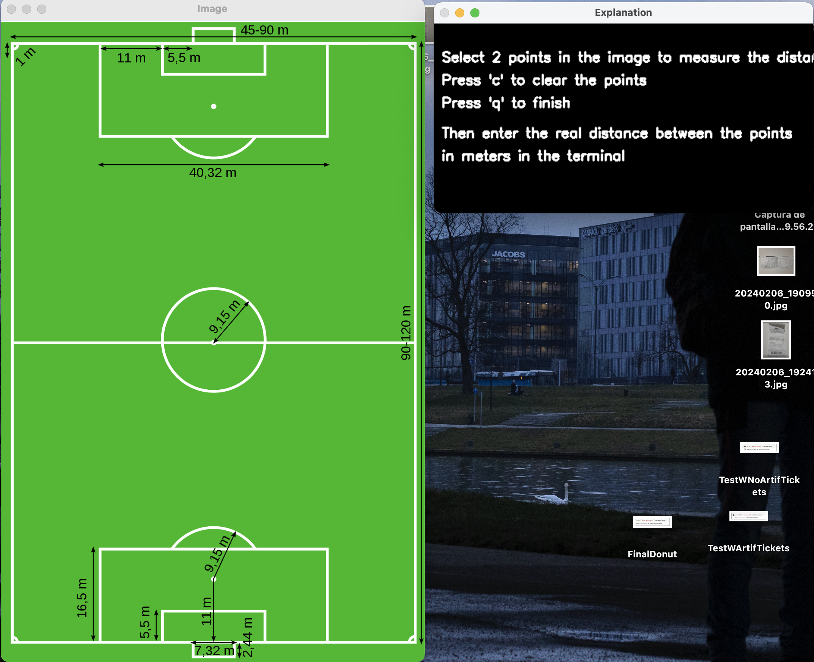
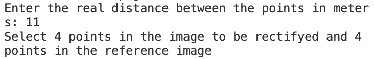
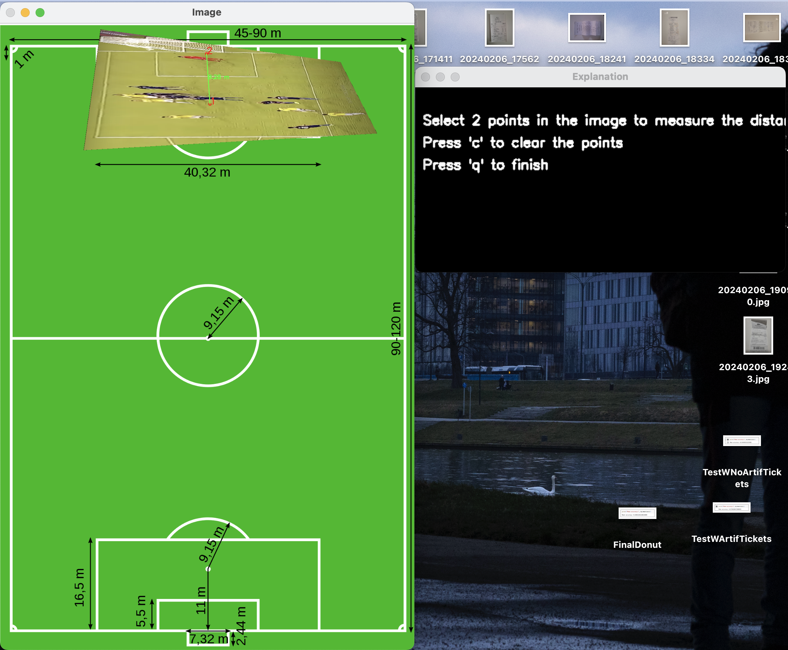

## RECTIF

In this task I decide to use the football field as a reference to measure distances. 

The script follows the next methodology:

1. Firstly to execute the script the user must give two paths, one to the image to be rectified and the other to the reference image.
 
    `rectif.py [-h] image image_ref`
2. Once in the script there is a help window which will tell the user what to do in each steap. In the firs step the user should select two points of the reference image and specify the real distance between them in the console.
    

3. After writing the distances on the console it indicates you the next step, which is to select 4 points in the image of reference and the image to be rectified.
    
    

4. Finally press 'q' to continue to the final step. In this step the image will be rectified over the reference image and the user will be able to select points in the rectified image to measure distances.
    

